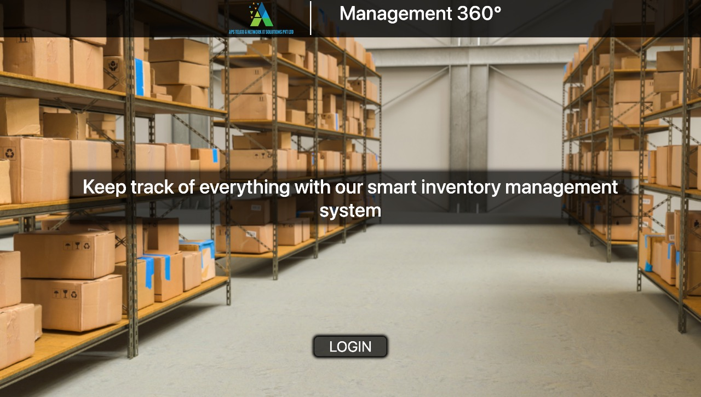
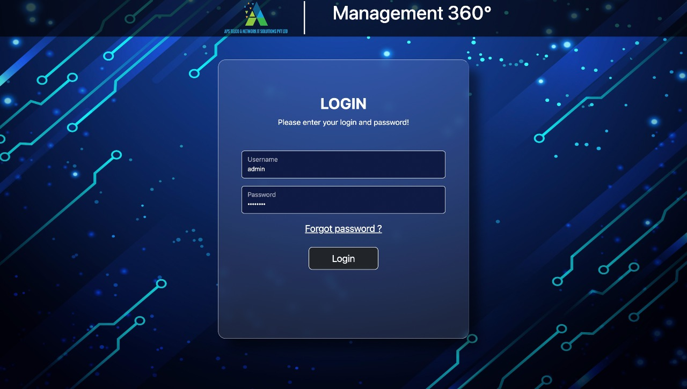
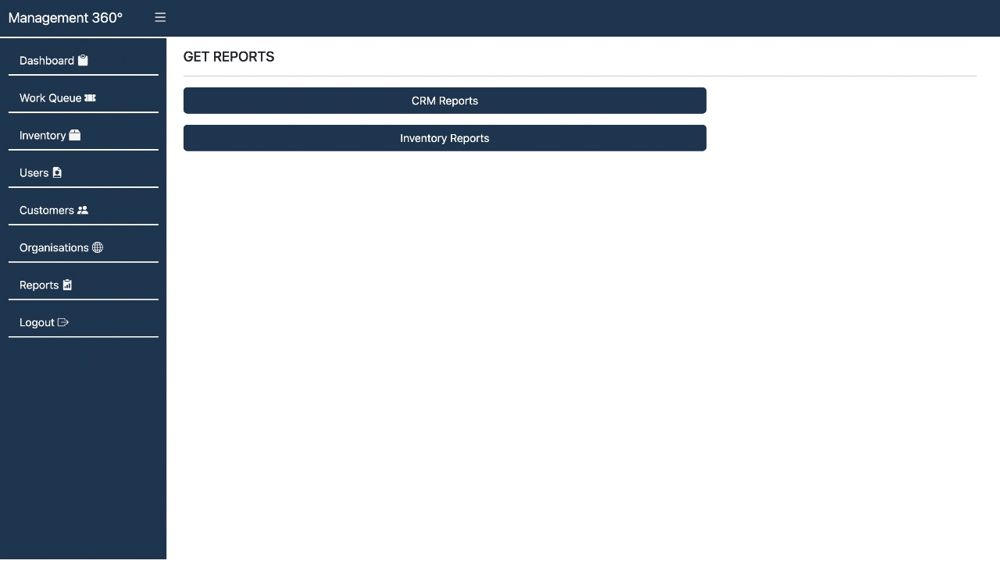
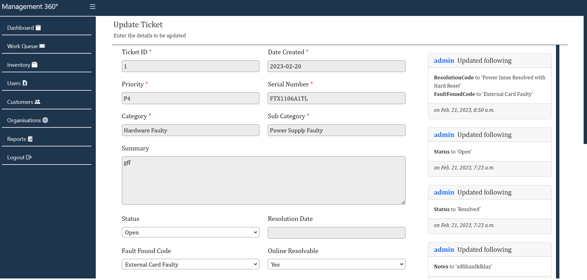

# CRM
APS Developers
Management tool to keep track of inventory from purchase & sale of goods & ticket management to assist with customer support.

Commands:

sudo systemctl start postgresql.service

source env/bin/activate

python manage.py runserver

